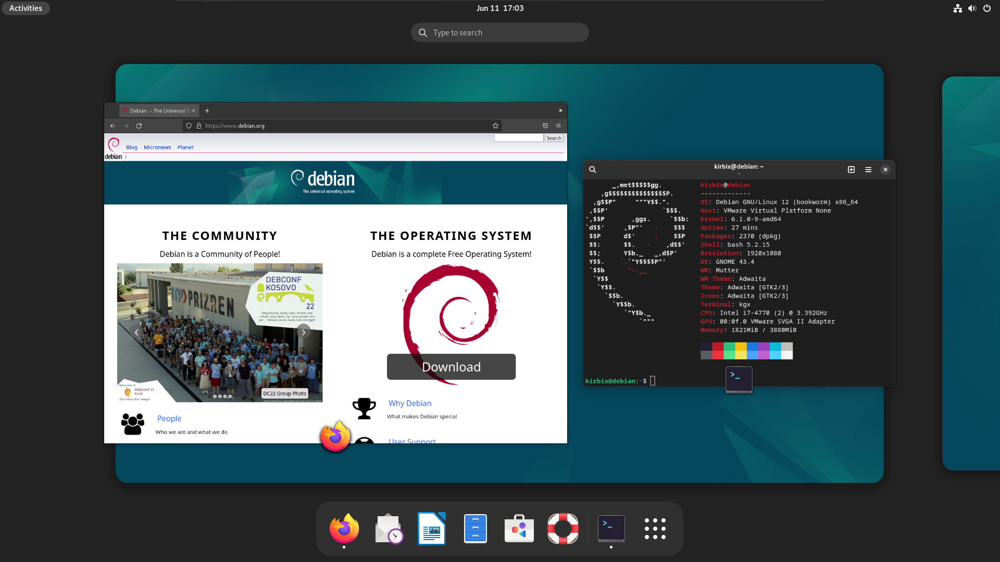
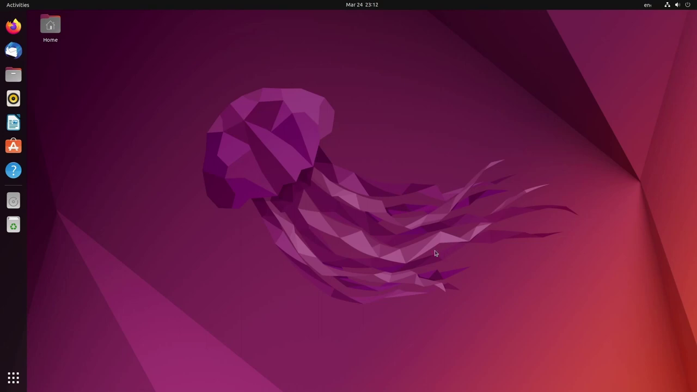
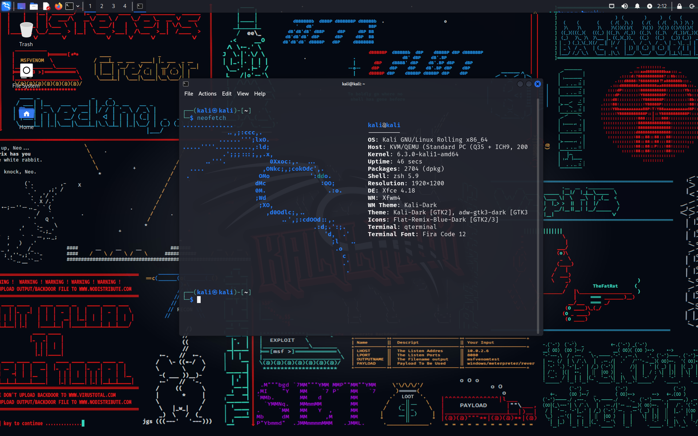
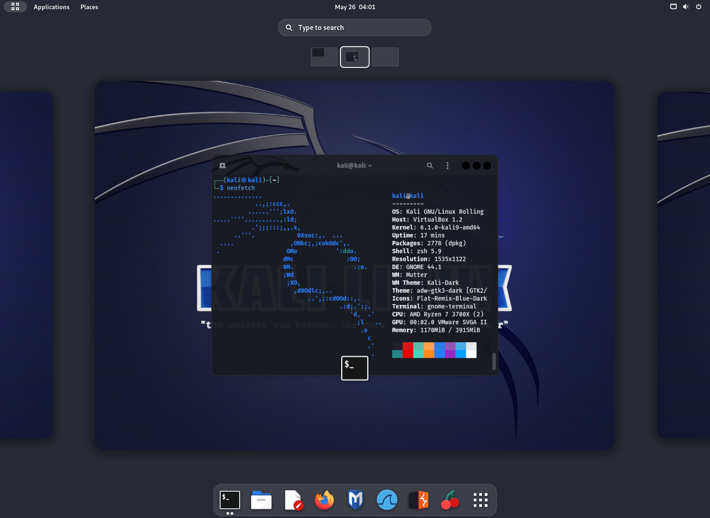
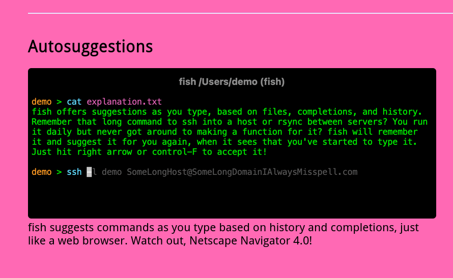
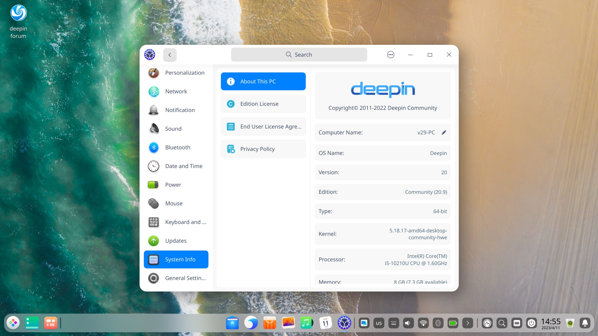
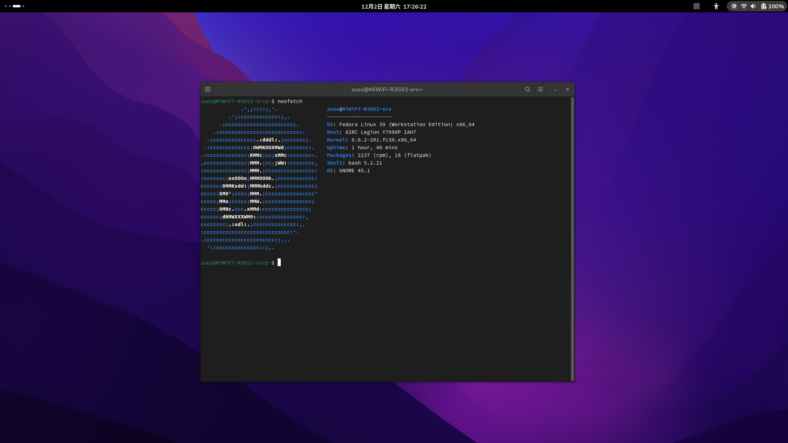
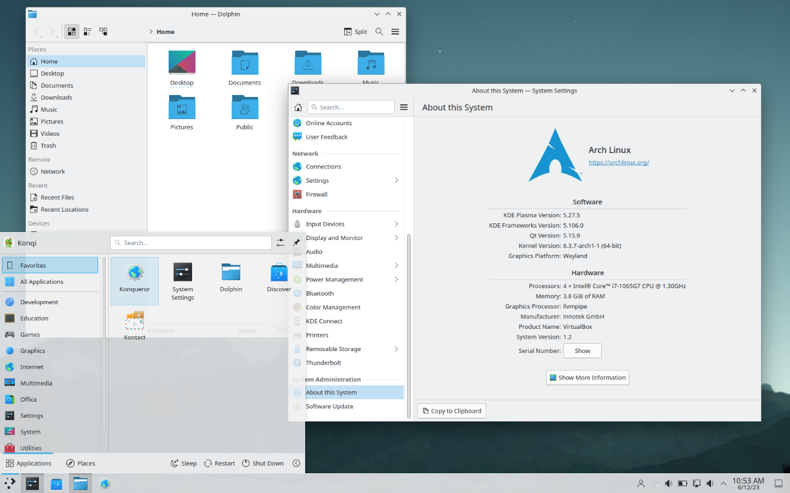
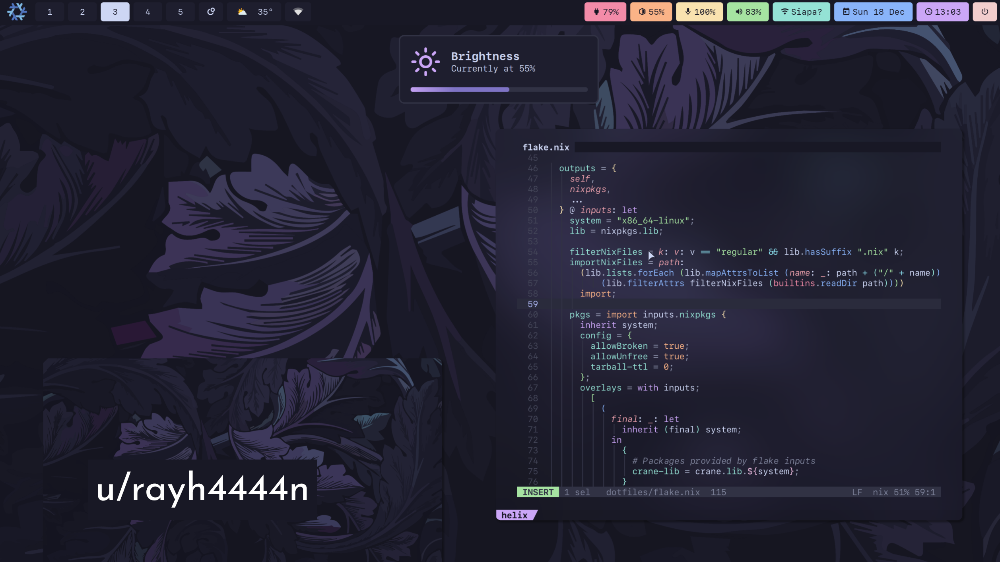

# 面向beginner: GNU/Linux发行版浅评与介绍

这里我会介绍常见的几个GNU/Linux发行版，这里我可能会假定你对计算机领域的一些知识比较了解了。

选择GNU/Linux 发行版很大程度上你是在选择软件包管理器，系统的更新策略。软件就在那里不会改变，OS之间的不同很大程度上看的是使用什么软件包管理器，比如是直接装二进制软件包还是从源代码开始编译，系统的更新策略一般分成随版本的更新，比如Ubuntu的LTS (Long-term support)应该是会推送五年的安全更新，之后就要换更新的LTS版本了；或者滚动更新，这样会一直向前更新，也就不会有版本的概念。部分发行版会同时推出这两种半分的发行版。

---

下面这些段落写于2024年2月

如果你并不是虚拟机安装Linux发行版的话，我认为应该还是要思考该类系统是否符合你的需求再说，当然如果你并不在意就当我没说。

现在来说，NVIDIA显卡驱动在Wayland桌面协议下的使用还有一堆事情，你会发现night light不可用，屏幕色温你根本无法调节。已知现在Linux发行版中能选择的桌面协议要么是之前的X11，要么是Wayland，其中X11是之前搞的，Wayland是新项目旨在取代X11，所以Wayland中存在XWayland去运行只支持X11的应用，但是这样Wayland带来的一些特性是不能很好的体验到的（比如Wayland较X11要安全一些）。如果你用的NVIDIA显卡，而且如果是新卡的话大概率使用nvidia-driver这个NVIDIA官方提供的闭源驱动，那么Wayland下并不能完美的运行XWayland模拟的应用。

现在还不支持HDR，浏览器对硬件解码的支持也不是很好，NVIDIA有自己的一套，其他显卡用另一套，其中FireFox还支持了一些硬件解码，Chromium内核的浏览器目前仍然处于实验状态，ChromiumOS和其他Linux发行版的文档会有说明可以尝试添加哪些参数启用这个功能。Chromium内核的浏览器默认还不是Wayland，如果你启用了会发现Fcitx5突然不好使了，解决方案也是有的，可以去看Fcitx5的文档。Chromium内核的软件在我这里缩放还有点问题（启用了Wayland之后）。

我不好评价GNU/Linux玩游戏会是怎样的体验，不过Valve公司基于wine搞了一个[Proton](https://en.wikipedia.org/wiki/Proton_(software))，只要在steam play中勾选为所有应用启用steam play就可以玩那些只支持Windows平台的游戏了，但不好评价是否能一定起作用，steam deck上搭载的系统steam os是基于Arch Linux做的，所以游戏方面也不至于那么难绷。有个非官方的网站[protondb](https://www.protondb.com/)，可以在这上面搜索一下特定游戏的评价，有玩家会在上面分享这个游戏运行起来的体验如何，如果是不太好运行的游戏，也许还会分享他们是如何让这个游戏跑起来的。

国内软件的适配还不是很好，听说腾讯会议虽然支持了Wayland，但是Wayland下的运行，窗口分享和摄像头都不能正常工作。QQ虽然存在Linux平台的版本，但仍然有一些小问题等待修复。微信则是根本没有相应的版本，大体上办法只有两种：搞个Windows的虚拟机运行微信，如果是VirtualBox或者VMWare这样的虚拟机管理软件直接开剪切板共享什么的，或者原生态一点就自己装spice驱动也可以，但还是不太贴合正常用户日常的使用，而且一整个虚拟机的占用也是有点难绷；还有就是用wine去模拟Windows的微信，直接上来就`wine wechat.exe`这样的其实并不能完美的运行，会有很多小问题，这时候就可以参考别人的项目，但貌似还是天生存在一些小问题无法解决——wine的微信不允许你传大于1MB的图片，并且小程序也用不了。

---

## OS

这里说的系不代表某个OS就是基于Linux kernel做的了，它可能也基于别的发行版，只不过我不知道了。下面关于发行版的截图大部分来自Wikipedia的图片，有一部分来自其在社交媒体上的官方账号发送的图片，当然也有几张是我自己截的。因为我自己懒得再装一遍，所以有的图片用的别人的，如果有机会装他们的发行版我就替换一下。

### Debian系

首先介绍Debian系，因为如果有国内软件是被官方支持开发Linux版本的，那么至少会给一个deb包（deb就是Debian系使用的软件包格式）。Debian系使用dpkg作为软件包管理器。

#### Debian Linux

官网链接：https://www.debian.org/

老牌OS了，在我认知中比Debian历史更加久远的应该就是Slackware。不过我本机没装过，虚拟机装过。我在安装Kali Linux的时候遇到了no-free firmware的问题，听别人讲貌似Debian Linux也会出现，不过这也是有些解决办法的，而且firmware这个检测是在对磁盘操作之前，不行了就不装这个系统，全身而退。Debian听说就是稳定，其实稳定就带来了使用的不是新版本的软件，毕竟时间方面，新版本没有经历过考验。不过听说如果给Debian添加一个testing软件源就可以尝鲜新版本了。说起来，虚拟机安装Debian Linux和Kali Linux的时候无论给多少内存（当然也就给过4G 8G的）默认都是把磁盘空间的1G给交换空间，剩下的是空间挂载到根目录，感觉很扯淡。

Debian默认不安装类似sudo这样的执行特权命令的程序，所以需要你自己安装，然后自己写相应的配置文件。（这个我有点忘了是不是了，sudo这样的软件是很有必要的，老生常谈的就是尽量减少攻击面之类的，直接su切换到root用户去执行*和系统相关的命令*是很危险的行为）

Debian Linux应该是随版本更新，不过貌似testing软件源可以让它作为滚动更新而存在。



图为Debian 12下的GNOME桌面。

Debian默认安装了libreoffice，我对这个软件没什么意见，这个office软件我感觉好像没有特别完美的兼容性。

#### Ubuntu Linux

官网链接：https://ubuntu.com/

基于Debian的OS，听说号称要做Linux中的Windows，莫非它做到了独裁？我将系统启动慢，软件启动慢归结于Ubuntu强推自家snap的问题，而且Ubuntu是我安装系统时体验最差的操作系统了（不过我也没装过太多回OS），启动速度慢，安装的速度也不咋地（这个可能是我自己网络的问题），而且默认安装的就是GNOME桌面环境，不允许安装的时候做出选择，桌面环境(DE, Desktop Environment)这个后续再谈。当然有使用不同DE的Ubuntu，但得下载对应系统的镜像文件了，比如使用KDE Plasma的叫做KUbuntu。这个KUbuntu大抵是比较适合作为一些新手（我指的是从Windows换到GNU/Linux）的，因为KDE和Windows桌面的使用习惯在我看来是差不多的（甚至KDE有一个主题就是旨在模仿Win11）。

再解释一下为什么认为KUbuntu大抵是比较适合作为一些新手，因为Debian/Ubuntu有着大量的用户群体，这里在我国貌似也不例外（可能是这样，我并不知道全国使用GNU/Linux发行版的这个具体情况，所以只能说可能是如此）。很多软件如若要有一个针对GNU/Linux平台的版本，那么很大概率就是Debian/Ubuntu了，而且一些教程如若提到了在GNU/Linux平台下该如何操作的话，大多至少都会假定你使用的是Debian/Ubuntu发行版。



图为Ubuntu 22.04 LTS版本的桌面图片，可以看到这里的Gnome和上面Debian的不太一样，Ubuntu的GNOME做了他们自己的修改。

Ubuntu认知中是随版本更新。

#### Kali Linux

官网链接：https://www.kali.org/

基于Debian testing源的Kali Linux安装界面类似Debian的系统安装界面，我曾经尝试给我的笔记本安装Kali Linux，但是体验不是很好，因为我卡在了no-free firmware，导致网络无法使用（悲），解决办法还是有的，我看Kali论坛上有人提出下载好对应的firmware再移动到系统安装盘内，不过我懒的整了。Kali Linux是否是一个可日用的操作系统，我无法评价（因为我没试过），不过对于一些做CyberSecurity方面的人来说，也许Kali Linxu对他们的诱惑还是有的，这里我想说它对你的诱惑如果仅仅是默认自带的那些配置好的软件的话，大可不必，自己配置不会花太多时间（毕竟都想在真机上折腾Linux了\[doge\]）。Kali Linux对DE做了美化，我认为美化的还是不错的。有一点值得说一下，Kali Linux不需要更换软件源的网址，大多数GNU/Linux发行版因为网络问题都需要更换软件源，除了国内公司搞的（比如Deepin/UOS或者openKylin之类）或者Kali Linux、OpenSUSE Linux，其他的貌似都得换源。

如果是为了那些软件的话，有一些发行版有针对CyberSecurity的衍生发行版，比如Arch Linux有个[BlackArch](https://www.blackarch.org/)，其搞了很多相关的工具，在Arch Linux上加个blackarch源就行了。


机缘巧合之下，我安装了Kali Linux虚拟机，故而下边两张Kali Linux的桌面截图的第一张就是我截的了。





第一张图片是Xfce桌面，第二张是GNOME桌面，这里没有太表现出来Kali Linux中对各家DE的美化。不过能看出来Terminal中对Shell的美化。

你可以和Debian的那张图片对比一下就可以发现不同之处。Debian那个使用的是bash并且没有看出有什么美化，尤其是PS1变量（就是**debian@debian**那个东西）就是默认的设置，但是Kali Linux默认除了bash之外还安装了zsh并且将zsh作为其默认的shell。并且它对zsh做了一些配置，比如那个**kali@kali**，zsh默认并不是这样的，这是Kali Linux自己的配置，而且默认还有对历史命令的猜测和对你输入的命令颜色上的美化，这是靠两个zsh的插件实现的。

插件[zsh-autosuggestions](https://github.com/zsh-users/zsh-autosuggestions)

插件[zsh-syntax-highlighting](https://github.com/zsh-users/zsh-syntax-highlighting)

写到这里突然发现我无法真正确定Kali Linux上的zsh是通过这两个插件得到的这个效果，但是这俩插件很受欢迎，大多数发行版对都是默认不装zsh的，所以你装zsh，网上的美化教程大多都会提到装上这两个插件。

我本身是bash作为shell环境，也懒得整zsh，我就贴一个fish shell官网的截图，zsh这两个插件就是旨在还原fish shell的效果



可以看到ssh后面是灰色的，这就是对历史命令的读取，只需要一个右键就可以直接根据这条历史命令补全当前输入的命令，并且cat和ssh之类的都有颜色，这是语法高亮，那两个插件就是还原这个效果。

Kali Linux我记得是滚动更新。

#### Deepin

官网链接：https://www.deepin.org/

Deepin操作系统作为我国国产的操作系统，我自然是要体验一番的（虽然只使用了一天左右吧），V20.x都是基于Debian的，截止目前，Deepin的V23还没有发布stable版本，V23开始就要自己做包管理器，也就是不再基于任何GNU/Linux操作系统。Deepin操作系统是我比较推荐新手使用的，不过我自己没使用过太久，所以可能这个OS没有我想象中那么新手友好。作为一款国产的操作系统，一些没有推出Linux版本的国内软件它有自带的解决方案（虽然我没记错的话，应该是用wine模拟的，wine是一个类Unix平台中运行exe程序的解决方案），Deepin自带的软件商店可以点击一下就安装了，还是比较方便的。Deepin默认使用自家的DE——DDE,这个DE我自认为不咋好看。

> Wine通过提供一个兼容层来将Windows的系统调用转换成与POSIX标准的系统调用。它还提供了Windows系统运行库的替代品和一些系统组件（像Internet Explorer，注册表，Windows Installer）的替代品

上面这段摘自[维基百科对wine的介绍](https://zh.wikipedia.org/wiki/Wine)。




Deepin应该是随版本更新。

### RedHat系

这个名字也不知道对不对。Redhat使用的大概是rpm包管理器。

#### Fedora

官网链接：https://fedoraproject.org/

Fedora Linux我没有本机安装过，不知道怎么样。作为一个商业公司的产品，软件版本比较新但没有特别新，比起Arch Linux自然旧了一些，总体来说还是挺新的。Fedora Linux我也说不出来啥，主要在于，除非Fedora有个Fedora-zh软件源我没发现，那么国内软件对其支持不好这一点将会是部分用户尝试Fedora Linux的绊脚石（我认为，因为这曾经绊住了我），不过可能用flatpak应该是可以解决这个问题，flatpak就是一个容器化的包管理器，其中的flathub作为flatpak的软件仓库存在一些国内软件。

---

23年12月更新：

我尝试真机安装了Fedora 39，体验还可以，flatpak确实可以解决问题。我第一次安装nvidia-driver-535可以那么完美的运行（当然我说的是在Xorg下）。Fedora默认就装上了flatpak，还安装了libreoffice。

---



这里可以发现和Debian差不多，Kali Linux那张没有体现出其对GNOME的主题美化。三家的GNOME都差不多，因为版本没有差出那么多，三家发行版其软件仓库中的软件版本可能不同，但仅局限于此。

Fedora 39搭载的是GNOME 45，Terminal用的是gnome-terminal，我认为还是不错的，gnome-console这个Terminal可设置选项太少了（泪目）

Fedora Linux是随版本更新。

### Arch系

Arch系使用pacman作为软件包管理器。不过Arch Linux提供了[AUR，Arch User Reposiory](https://aur.archlinux.org/)，这是一个用户软件仓库，提供了Arch Linux官方仓库没有的软件，比如linuxqq，一些国产软件都在AUR里可以找到，不过AUR不过是一个构建软件的脚本，对应软件得在AUR的PKGBUILD中写好的网址去拿对应的包。如果是国内软件安装还好说，其他的比如有些从GitHub拿的就得配置好网络了。Arch有个archlinuxcn软件仓库，有一些额外的软件可以直接安装，中科大有archlinuxcn的软件源。 AUR应该是GNU/Linux平台中软件包数量很多的平台了，能超过它的可能只有NixOS的（在我的认知中）。

#### Arch Linux

官网链接：https://archlinux.org/

Arch Linux我只用了五个月左右就换成Gentoo Linux了，时间不长，我也不清楚滚动更新带来的滚挂能不能出现，反正我没遇到过，不过这个问题讨论之前应该定义一下什么是滚挂，之前我有过一回在登陆管理器登进去就黑屏，后来看到了错误日志发现貌似是nouveau的问题，我在kernel启动参数禁用nouveau就好了。这种算不算挂，应该不算吧。不过可以尝试安装TimeShift定时做快照给自己一个心理安慰，我当时整来着，就是快照就没有用过。

Arch Linux是我推荐在Deepin待过一会就尝试的操作系统，虽然这个系统需要使用命令来安装，没有安装界面，所以可能有些困难，不过[Arch Wiki](https://wiki.archlinux.org/title/Main_page)写的还是不错的，可以结合着别人的安装指南来看，wiki和指南一起看，虚拟机尝试一手，就差不多了。这样的命令安装也许能让你对你的操作系统更有一个掌握的感觉（自认为）。

而且我认为有一个Arch Linux的启动盘是有必要的，因为这样能一定程度上解决一些你需要进入系统才能解决的类似无法进入系统的问题。



这里放一个KDE Plasma桌面的截图，之后也就不放截图了，因为后续的发行版没有对桌面环境有什么太出彩的美化，这里放截图纯属因为还没放过KDE Plasma的截图（）。

Arch Linux是滚动更新。

#### Manjaro Linux

官网链接：https://manjaro.org

Manjaro是基于Arch Linux做的OS，比Arch仓库的软件推送慢了两周还是多长时间来着，旨在提供比Arch更稳定的软件（这个是听说）。Manjaro的优势或许就在于它有一个安装界面，可以点点点就开始安装了，不需要输入命令。我看到过一个吐槽Manjaro Linux的，认为这降低了Arch Linux的门槛，反而让一些因此才使用的用户无法应对使用中可能遇到的问题。当然我并不认为这会有大不了的（）。我曾经在某年冬天就抱着要装Manjaro双系统的想法，当然后来我是Arch Linux单系统（逃）。

Manjaro Linux是滚动更新。

### OpenSUSE系

说是系，我目前还不知道哪个系统是基于OpenSUSE做的。OpenSUSE使用zypper作为软件包管理器。

#### OpenSUSE Linux

官网链接：https://www.opensuse.org/

OpenSUSE Linux提供了滚动更新和版本更新两种更新方式，这对应它两个版本。有个类似AUR的用户软件仓库OBS，不过我不是很了解OBS，也不再多说什么了。OpenSUSE Linux有别的OS都没有的Yast客户端，这个GUI软件可以完成很多特权操作，比如安装软件啥的（我没有太试过OpenSUSE,我也没有太用过Yast）。而且OpenSUSE的软件源网址貌似可以自动给你选一个近的软件源去下载软件，可以让你使用官方源的时候也保持着还不错的速度。

就像上一段开头说的那样，OpenSUSE Linux提供了滚动更新和依版本更新两种方式，分别是OpenSUSE Tumbleweed和OpenSUSE Leap。

### Gentoo系

Gentoo系使用emerge软件包管理器，软件大多都是从源码开始安装。部分大型软件提供了二进制软件包版本。

#### Gentoo Linux

官网链接：https://www.gentoo.org

Gentoo Linux的软件版本相较于Arch Linux没有那么新，而且对国内用户的支持没有那么友好，只有gentoo官方源才有镜像源，官方网站上还只有三个，实际上不止有三个，我比较推荐不在那三个之列的中科大源。Gentoo官方软件仓库没有fcitx5（如果你不知道fcitx5是什么，我会在DE介绍那里说一下），要用的话推荐添加gentoo-zh软件仓库安装fcitx5，其他一些国内软件gentoo-zh仓库也有收录，由于这个仓库是在GitHub上的，所以需要解决了网络问题才能同步最新gentoo-zh的软件信息。信安软件方面，有个基于Gentoo的叫Pentoo的OS,可以添加pentoo的软件仓库安装Gentoo软件仓库没有的信安这一块的软件。

Gentoo Linux的安装并不完全依赖于它的安装介质，比如我是使用Arch Linux的系统安装盘去装的Gentoo。

emerge的优点在于提供了USE变量，它允许用户自己决定软件的功能支持以确定依赖关系。Arch Linux可能可以认为是可以定制你的系统，Gentoo Linux就是可以定制你的软件。

> USE是Gentoo为用户提供的最具威力的变量之一。很多程序通过它可以选择编译或者不编译某些可选的支持。例如，一些程序可以在编译时加入对 GTK+或是对Qt的支持。其它的程序可以在编译时加入或不加入对于SLL的支持。有些程序甚至可以在编译时加入对framebuffer的支持（svgalib）以取代X11（X服务器）。
大多数的发行版会使用尽可能多的支持特性编译它们的软件包，这既增加了软件的大小也减慢了启动时间，而这些还没有算上可能会涉及到的大量依赖性问题。Gentoo可以让你自己定义软件编译的选项，而这正是USE要做的事。
在USE变量里你可以定义关键字，它被用来对应相应的编译选项。例如，ssl将会把SSL支持编译到程序中以支持它。-X会移除其对于X服务器的支持（注意前面的减号）。gnome gtk -kde -qt5 将会以支持GNOME（和GTK+）但不支持KDE（和Qt）的方式编译软件，使系统为GNOME做完全调整（如果架构支持）。

摘自[Gentoo amd64 安装手册](https://wiki.gentoo.org/wiki/Handbook:AMD64/Full/Installation/zh-cn#.E9.85.8D.E7.BD.AE_USE_.E5.8F.98.E9.87.8F)

当然还有很多变量，比如CFLAGS, L10N, VIDEO_CARDS这些，可以指定编译选项，本地语言和显卡设备

Gentoo Linux的USE变量是一把双刃剑，完全靠用户自己。比如我曾经以为我只需要安装一个小软件，结果它的依赖还是它（我没细看）需要编译器的的几个USE变量也开启才行，结果我就还得把编译器以及依赖都编译一遍😇。当然如果你都配置好了，日常使用的体验还是可以的。

Gentoo Linux是滚动更新。

### Nix系

Nix系使用的是Nix作为包管理器，这是一个[是一个纯函数式包管理器，旨在使软件包管理可靠且可重现](https://wiki.archlinuxcn.org/wiki/Nix)。特点在于不遵守FHS标准，每个软件的每个版本都有一个独特的哈希值标明，并且通过符号链接的方式自由选择某些软件的某个版本作为当前使用版本，所以可以避免所谓依赖地狱这样的问题。Nix系大抵只有NixOS吧，有个和Nix包管理器差不多的叫作[GNU Guix](https://en.wikipedia.org/wiki/GNU_Guix)，基于这个包管理器也有一个OS，就是Guix OS。

FHS (Filesystem Hierarchy Standard)标准规定了文件系统中每个部分的大致用途和名称，比如/etc存放配置文件，/bin存放可执行文件，/lib存放可执行文件使用的链接库。

依赖地狱(Dependency hell)这个问题我自身没遇到过，这个问题虽然有多种表现形式，但是我认为大体上你最多可能看到其中的一种情况——你安装了软件A，其依赖于软件B 3.2版本，之后你又想安装软件C，但是它依赖于软件B >= 3.4版本，这时候版本之间就发生了冲突。

其实软件包管理器一定程度上解决了依赖地狱的一些问题，当然有的软件包管理器貌似没有版本的概念，也就没有刚刚我说的这个问题的存在。

Nix靠将每个软件包都安装在`/nix/store`文件夹中并附上一个唯一的哈希值作为标记，保证了软件包依赖的独立性，不同软件的相同的依赖会因为这个哈希值而被标识为是对方的依赖，从而解决了依赖地狱的问题。当然，这样的方式也造成了磁盘空间的占用。Nix存在着大量的软链接，其通过链接的方式做到指定当前环境的每个软件的版本是多少。

#### NixOS

官网链接：https://nixos.org/

NixOS提供两种安装方式——图形化安装和手动安装。图形化安装就像Fedora这样的发行版一样提供一个带DE的LiveCD环境，不过这种安装受到我国网络环境的限制，不过都有DE了，是否在设置里设定一下代理，或者像clash这样的代理工具开tun模式可以完成下载软件的步骤🤔。反正我是手动安装的。该系统的特点是大部分的配置可以写在`/etc/nixos/configuration.nix`中，比如对软件，services，用户的管理等等。在安装软件的时候可能涉及到从诸如GitHub之类的网站下载补丁或者源码，所以做好网络环境的配置是必要的。

但是安装软件的是否可能涉及到从GitHub之类的网站下载东西，或者如果你使用NUR的话（我不清楚NUR是否有国内源），NUR仓库在GitHub上，所以你需要配置好网络环境才行。

我安装好后发现，`nixos-rebuild`更新时，哪怕我在Terminal上export了proxy依旧不好使，这是因为它会从services中读取代理配置，也就是说需要写在configuration.nix中，关于代理的配置在默认生成的配置文件里就写好了，只不过被注释了，取消注释再修改一番即可。

```bash
$ systemctl cat nix-daemon  | grep proxy
```

可以运行上述命令查看是否设置了代理

不过说实话，当我设置完打开Termianl，`env | grep proxy`发现它会直接在你的终端里配置好proxy环境变量

```bash
$ env | grep proxy
all_proxy=http://<ip>:<port>
https_proxy=http://<ip>:<port>
http_proxy=http://<ip>:<port>
rsync_proxy=http://<ip>:<port>
no_proxy=127.0.0.1,localhost
ftp_proxy=http://<ip>:<port>
```

在这一刻，我甚至有些怀疑当初是不是我环境变量设置错了，但也懒的验证这件事了。

不过这不仅仅是在Terminal中配置好了这些环境变量这么简单，虽然我不清楚这个环境变量是什么时候配置的，但是在我认知中其fork的进程会继承那些环境变量，我的意思是这样其实就实现了一种系统代理，个人使用的时候和正常开启了系统代理的效果差不多。

之后我发现，Nix这种特性在我安装交叉编译链的时候有那么一点点不友好，我难以忍受我需要为了riscv结构的qemu装那么多软件（逃）。当然NixOS有很多有意思的feature，所以可能存在一个更加好的方式去安装交叉编译链，只不过我不知道了。

NixOS不遵守FHS标准，所以正常的chroot也不好进去，使用它们自己提供的程序即可，我记得是叫做`nix-enter`。

---

只要你不是安装那种不能选择DE的发行版，那么选择一个DE就是你不得不做的一件事。

---

## DE

> 桌面环境将各种组件捆绑在一起，以提供常见的图形用户界面元素，如图标、工具栏、壁纸和桌面小部件。此外，大多数桌面环境包括一套集成的应用程序和实用程序。最重要的是，桌面环境提供了他们自己的窗口管理器，然而通常可以用另一个兼容的窗口管理器来代替。

桌面环境我只浅谈一下KDE Plasma, GNOME和xfce。我在下面谈到了对Wayland的支持问题，如果你是NVIDIA独显驱动用户的话，GNOME是禁用Wayland的，KDE plasma不禁用。如果你要使用Wayland，输入法框架方面就不能选择fcitx，只能选择fcitx5了。ibus我没用过，不知道怎么样。我一直是fcitx5用户（逃）。我引入了输入法框架这个名词，但是没有太多解释，我这里就放一个[Arch zhWiki中输入法条目的链接](https://wiki.archlinuxcn.org/wiki/%E8%BE%93%E5%85%A5%E6%B3%95)。当然，各家DE都是有美化的空间的，具体你可以去搜一搜相关的美化教程，我本人是懒得做这些事情，所以也就没什么好说的了。

### KDE plasma

KDE Plasma是相当受欢迎的DE了，而且一定程度上和Win10的桌面有些像，所以对于一些人来说可能会比较熟悉。KDE设置提供了很多选项，可以说KDE可以设置的地方很多。KDE的音频控制组件貌似不是很支持pipewire，我知道的是Arch Linux用户可以安装pipewire-pulse兼容层解决这个问题，Gentoo虽然也有这个，但貌似不是很好使的样子（后来好使了，不清楚我这两回之间有什么操作上的差异）。KDE自带一些监控硬件参数的状态栏组件还是比较不错的，Xfce也有类似的，GNOME就没有这东西了（GNOME也有SystemMonitor提供这个功能，但无法在状态栏上显示）。甚至GNOME默认是没有系统托盘的，这个还需要安装相应的插件来实现。

KDE Plasma目前貌似还存在一个问题——Wayland下的部分应用无法正确显示图标，而是显示一个Wayland默认图标。这个问题不清楚在Plasma 6中是否还存在。

我认为KDE Plasma什么都不错，就是颜值差了些。

### GNOME

GNOME默认使用Wayland，当然如果检测到机器使用NVIDIA独显驱动，那就不会用Wayland了。我认为GNOME默认还是挺不错的，我指的是颜值。

Electron和Chromium不同的是，你未必能够解决无法输入中文这个问题（在Wayland中），你可以通过传递flag的方式用以Wayland启动软件，但由于Electron目前还不支持gtk4导致无法在GNOME桌面环境中输入中文（如果用Wayland的话）。

有的发行版的GDM是不可以和NVIDIA闭源驱动搭配正常工作的。我说的就是NixOS的gdm，我在使用GNOME的时候使用的lightdm起的gnome，但gdm和gnome是一套的，所以我猜测GNOME下`Win + L`不可以锁屏是因为dm不是gdm的原因？dm是用来从tty shell上启动到桌面环境的图形化界面。

GDM貌似就是检测到是NVIDIA驱动就不启动Wayland会话，但应该是你给NVIDIA驱动用什么“DRM 内核级显示模式”启动的话就可以上Wayland了。（不好评价真假，因为我忘了）

有一点我认为比较难绷的是，GNOME的设置里没有分数缩放这个功能，屏幕的缩放只能是整数的，只能在*优化*这个软件（软件包名应该叫gnome-tweaks，有的发行版可能有个gnome3-前缀）。我不好评价gnome-tweaks那里的那个选项该不该认为是分数缩放，但反正，差不多吧。

GNOME的night-light只有根据地区设置和手动修改，没有一直开启（可能除了那俩选项还有别的，但反正没有一直开启），我只能手动修改，时间设置为0:00 ~ 23:59这个时间段

这句话写于23年10月18日：Redhat试图让GNOEME之后至支持Wayland，不知道什么时候能实现，当然Wayland被认为是下一代的桌面协议，应该是得替换掉Xorg的，性能上不清楚，安全性上好像是会好一些，而且Wayland好像原生支持分数缩放，Xorg还不支持这个，桌面环境的分数缩放都是自己的功能？

### Xfce

xfce这个DE有点就是简洁消耗小。Xfce家族的软件都不是那么花哨，其大小也还不错，所以一些WM用户可能会选择安装Xfce家族的部分软件。你尝试装的时候就会发现Xfce需要装的软件真的少，所以功能也不是很多，当然核心的那些都有，没有什么问题。KDE Plasma和GNOME都默认Waylnd了，Xfce还是在下个版本才默认Wayland还是对Wayland有良好的支持来着？

## WM

WM（WIndow Manager,窗口管理器）是比DE更低级的东西，一般可以带来更低的消耗，尤其是平铺式的WM可以带来更好的视觉体验。由于WM大多数时候都是需要键盘就行，我还听到一个言论就是使用WM更不容易得鼠标手（）。

WM不会自带很多东西，比如应用程度启动器，壁纸，窗口渲染，声音和亮度调节，polkit前端组件等等，这些都需要你去自己装上，当然有的WM可能会自带窗口渲染或是其他什么的。那些DE也都有自家的Terminal，虽然WM也可能自家有Terminal（比如开发dwm的组织也开发了st Terminal）不过不会自动安装，这个也需要自己装上。

WM我只浅谈一下i3wm, dwm和Hyprland。

### i3wm

这是一个知名的WM了，基于X11，我用的时候是在用户目录的.xinitrc文件中写了`exec i3`通过startx命令在tty shell启动i3wm。配置文件在用户目录的.config/i3文件夹中。Kali Linux中对i3WM好像有个美化看起来有些意思，我懒得装Kali Linux的虚拟机了，看官网Blog中的图片感觉还有些意思。

这里插一嘴，所以这里有个新玩法，即只让一个软件运行以求更好的性能，也是在.xinitrc写`exec <program>`然后startx运行。

### dwm

这是比i3wm消耗更低的wm,也是我比较推荐的wm了，缺点就是配置文件也是需要参与到编译环节的，每次更改配置文件都得重新编译dwm。dwm比i3wm还要简洁，所以你需要补丁才行。dwm也是基于X11的。这里就要所说Gentoo Linux了，Gentoo的dwm提供了一个USE变量savedconfig，这会让Gentoo把默认的配置文件放到一个目录中，每次你更改这个文件再`emerge dwm`就行，它会读取那个目录的文件参与编译。

### Hyparland

Hyprland是基于Wayland做的WM，官网对NVIDIA独显驱动用户的使用列了一个非官方的解决方案。不过我选择使用Intel核显体验一手，当时Hyprland戳我的点就是官网主页列的截图



真的好帅啊，当然Hyparland默认不是这样的，你需要安装其他的软件进行进一步的配置。
