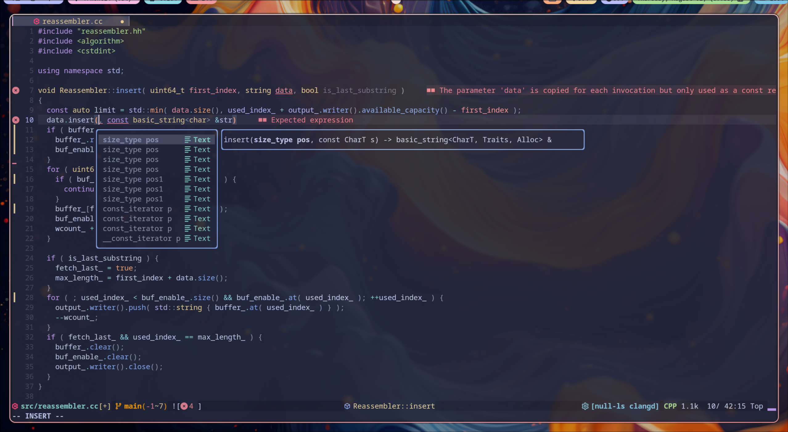
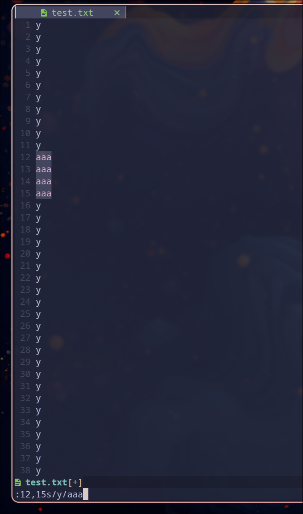

# 我的 neovim 配置

先放个我配置后的样子:



## 背景

我在第一次接触 GNU/Linux 的时候，就有听说过 vi/vim，那时候我还只知道如何在 insert, normal 等模式中切换，如何保存并退出文件。甚至我那时候还不知道有 GNU nano，后来知道了 nano 这个软件后，简单的编辑文件的工作我就会使用 nano，基本不会太用到 vim 了。

后来我使用了一些 WM 来当成桌面（比如 i3, dwm），我在搜集资料时接触到了更多使用这些 WM 还使用 vim/neovim 的用户（只能说使用 WM 的大多更习惯使用终端）。不过我不是这时候听说 neovim 的，我已经忘了怎么听说 neovim 的了。

但在我希望使用 Wayland 的桌面之后，我就一定程度上有了更多使用 vim 操作的想法。这个想法是在我使用 GNOME 桌面环境时候产生的，因为 GNOME 的 mutter 只实现了 text-input-v3，导致不支持 text-input-v3 的 VSCodium 无法正常使用 fcitx5，这让我输入中文的时候很难受。于是我就有了使用 neovim 的想法，因为终端是可以输入中文的（不过也许现在可以考虑下 zed 🤔），至于为什么选择 neovim，因为听说比 vim 好用（我记得比较多的是 vimrc 和 lua 的对比，但是我本身没有配置 vim 的经历，所以我没有这种比较）。

使用 neovim 给我比较好的两个印象，一个 normal 模式和 insert 模式的光标是不一样的，看着还不错，另一个是 `:s` 搜索替换时，键入替换后的字符串后，当前界面那些要替换的字符会自动跟着修改，我印象中vim 默认不是这样的。



## 使用的插件

大致上是使用了这些插件:

- 管理插件，用于插件的安装安装配置更新等工作
  - [folke/lazy.nvim](https://github.com/folke/lazy.nvim)
- 管理 lsp
  - [williamboman/mason.nvim](https://github.com/williamboman/mason.nvim)
- lsp 相关配置
  - [neovim/nvim-lspconfig](https://github.com/neovim/nvim-lspconfig)
- 代码补全相关
  - [hrsh7th/nvim-cmp](https://github.com/hrsh7th/nvim-cmp)
  - [hrsh7th/cmp-nvim-lsp](https://github.com/hrsh7th/cmp-nvim-lsp)
  - [hrsh7th/cmp-nvim-lsp-signature-help](https://github.com/hrsh7th/cmp-nvim-lsp-signature-help)
  - [hrsh7th/cmp-path](https://github.com/hrsh7th/cmp-path)
  - [hrsh7th/cmp-cmdline](https://github.com/hrsh7th/cmp-cmdline)
  - [hrsh7th/cmp-buffer](https://github.com/hrsh7th/cmp-buffer)
  - [rafamadriz/friendly-snippets](https://github.com/rafamadriz/friendly-snippets)
  - [L3MON4D3/LuaSnip](https://github.com/L3MON4D3/LuaSnip)
  - [saadparwaiz1/cmp_luasnip](https://github.com/saadparwaiz1/cmp_luasnip)
- UI 相关
  - [folke/trouble.nvim](https://github.com/folke/trouble.nvim)
  - [nvim-treesitter/nvim-treesitter](https://github.com/nvim-treesitter/nvim-treesitter)
  - [rebelot/heirline.nvim](https://github.com/rebelot/heirline.nvim)
  - [romgrk/barbar.nvim](https://github.com/romgrk/barbar.nvim)
  - [nvim-neo-tree/neo-tree.nvim](https://github.com/nvim-neo-tree/neo-tree.nvim)
- utils
  - [nvim-telescope/telescope.nvim](https://github.com/nvim-telescope/telescope.nvim)
  - [akinsho/toggleterm.nvim](https://github.com/akinsho/toggleterm.nvim)
  - [lewis6991/gitsigns.nvim](https://github.com/lewis6991/gitsigns.nvim)
- 调试器集成
  - [mfussenegger/nvim-dap](https://github.com/mfussenegger/nvim-dap)
  - [rcarriga/nvim-dap-ui](https://github.com/rcarriga/nvim-dap-ui)

调试器就这些是因为我目前就打算先配置 C/C++ 的调试环境，用的是我本机的 gdb，也就没想装一个类似 `mason` 这样的插件。

代码补全相关中，`nvim-cmp` 是用来补全的插件，那些以 `nvim-cmp` 为前缀的都是具体要补全的项，比如 `nvim-cmp-lsp` 是根据 lsp 的补全，`nvim-cmp-path` 是根据路径的补全，`nvim-cmp-buffer` 是根据当前打开的文件内容的补全等等，`LuaSnip` 是一个代码片段引擎，`friendly-snippets` 则是一个实用代码片段集合。

UI 相关中，`rebelot/heirline` 是用于显示底部的状态栏的，虽然这个插件也能定制顶部的 TabLine，但是我懒得去学了，直接用的 `romgrk/barbar`。

调试器方面，dap 给我的感觉类似于 lsp 一样，不过我没仔细了解，[nvim-dap 中有文档](https://github.com/mfussenegger/nvim-dap/wiki/Debug-Adapter-installation) 描述了支持的调试器。我根据文档配置了 gdb 的调试环境。

## tricks

一开始我配置完底部状态栏有个问题，每个窗口都有一个单独的状态栏，但我不需要这样，后来我在 Youtube 上找到个博主自称需要添加这行代码就可以解决:

```lua
vim.opt.laststatus = 3
```

真的是这样，泪目

lsp 的错误诊断无法在插入模式下使用，后来在 Stack Overflow 的一个帖子上找到了答案

```lua
vim.lsp.handlers["textDocument/publishDiagnostics"] = vim.lsp.with(
  vim.lsp.diagnostic.on_publish_diagnostics, {
    update_in_insert = true,
  }
)
```

当开了多个窗口的时候，`q` 只能退出当前的窗口，可以使用 `qa`，这样可以直接退出全部窗口。

## 具体配置

```bash
$ tree
.
├── init.lua
├── lazy-lock.json
└── lua
    ├── config
    │   ├── colorscheme.lua
    │   ├── keymap.lua
    │   ├── lazy.lua
    │   └── option.lua
    ├── lsp
    │   └── clangd.lua
    └── plugins
        ├── cmp.lua
        ├── config
        │   ├── cmp.lua
        │   ├── lsp.lua
        │   ├── none-ls.lua
        │   ├── telescope.lua
        │   ├── treesitter.lua
        │   ├── ui_bar.lua
        │   └── ui_fs_tree.lua
        ├── debug.lua
        ├── lsp.lua
        ├── ui.lua
        └── util.lua

6 directories, 19 files
```

这是我的目录架构

TODO: 介绍配置文件的细节
