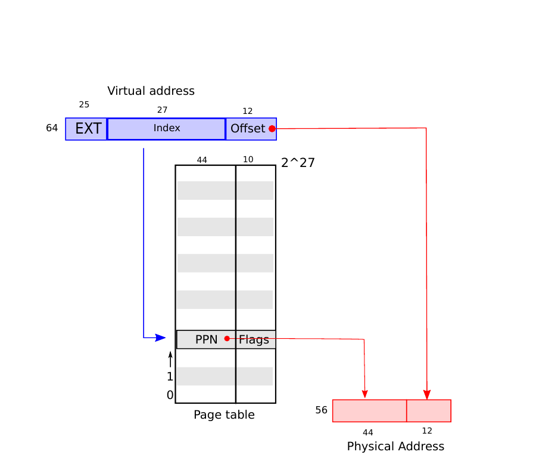
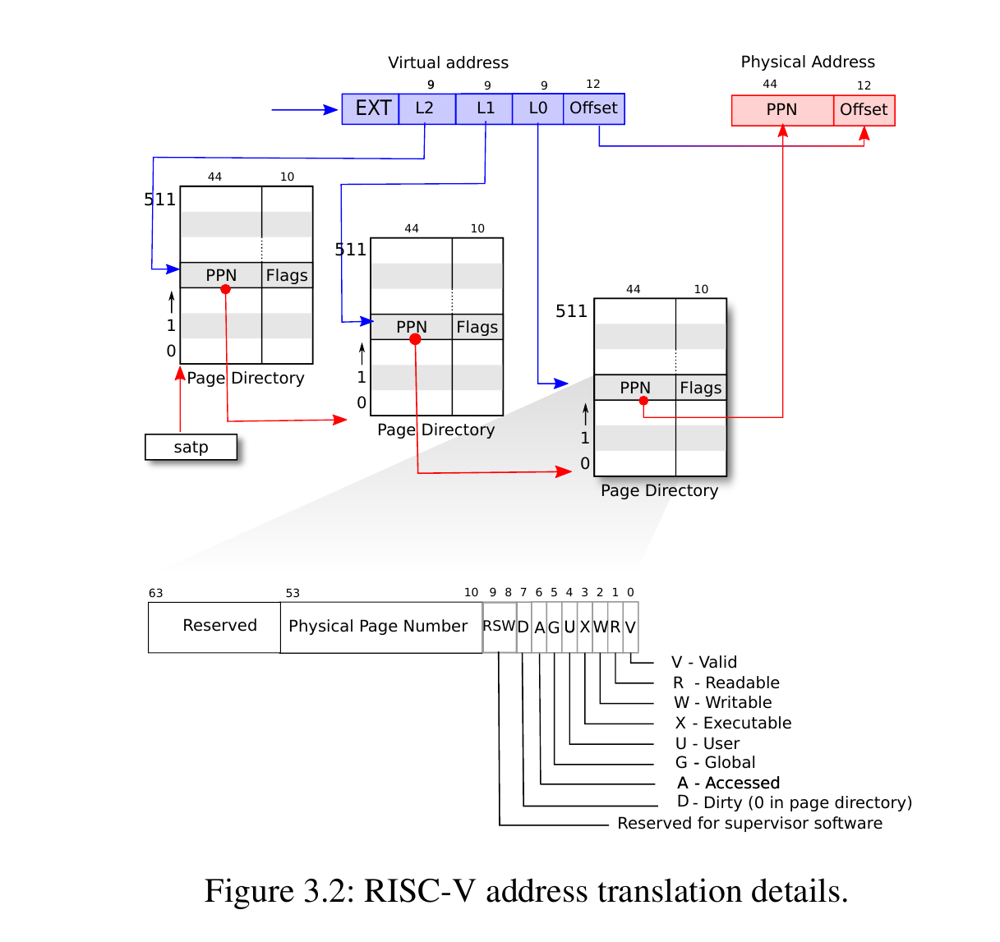
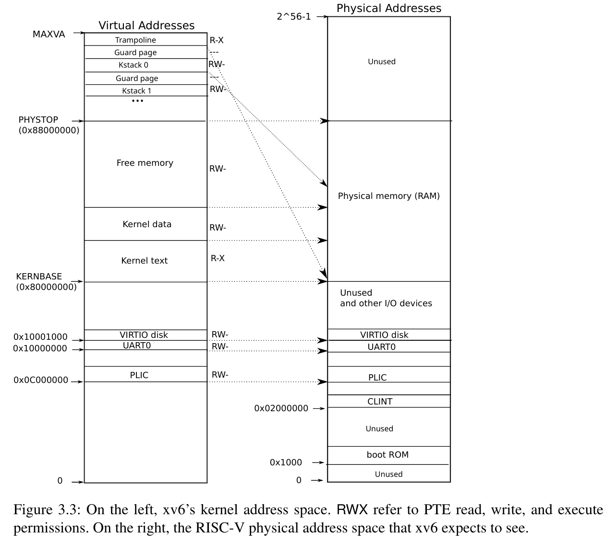
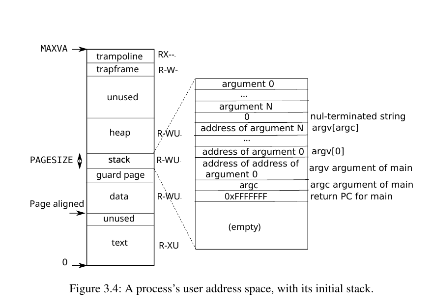

# Page tables

操作系统通过页表给每个进程自己的私有地址空间和内存。Xv6依此可以隔离不同的进程地址空间并在单个物理内存上重复使用。页表这种设计因在一定程度上允许操作系统可以整活而流行。Xv6中就利用页表整了一些活：

- 在几个地址空间映射相同的内存（trampoline page）
- 使用一个未映射的页去保护内核和用户栈

## 页表硬件
RISC-V指令操控虚拟地址，机器的RAM或物理内存由物理地址来索引。RISC-V页表硬件可以将虚拟地址映射到物理地址。

Xv6运行在Sv39 RISC-V上，也就是说它只使用64 bit虚拟地址的低39 bit。在Sv39配置中，RISC-V页表逻辑上包含 2^27^ （134,217,728） 个page table entries (PTE)。每个PTE包含一个44 bit的physical page number (PPN)和一些flag。页表硬件通过使用39位的高27位翻译成虚拟地址索引到页表中去寻找一个PTE，并且生成一个56 bit的物理地址（其中顶部44 bit来自PTE的PPN，底部12 bit复制于原始虚拟地址。页表使得操作系统能够以4096 (2^12^)字节为一个块对虚拟地址到物理地址的转换进行控制，这个块被称为页。



在Sv39 RISC-V中，虚拟地址的高25 bit不必转换。物理地址还有增长空间：PTE格式有空间让物理页面的数量增加10 bit。RISC-V设计者根据预测技术选择了这些数字，2^39^就是512GB作为软件足够的地址空间。在不久的将来，2^56^是容纳许多的I/O设备和DRAM芯片的物理内存空间。如果需要更多，RISC-V设计者已经定义了使用48 bit虚拟地址对Sv48

RISC-V CPU通过三步将虚拟地址翻译成物理地址，一个页表作为三级的树被存储在物理内存。这个树的根是一个4096字节的包含512个PTE的页表页，这些PTE包含下一级页表的物理地址。分页硬件使用27 bit中高9 bit在页表页对根部选择一个PTE，中间9比特在下一级选择一个PTE，底部9比特选择最后的PTE（Sv48 RISC-V中的页表有四级，使用虚拟地址对的39 bit到47 bit索引到顶级。



如果转换地址的三个PTE中的任何一个不存在，分页硬件将引发page-fault exception，将异常留给内核处理。

比起上边展示一级结构，三级的结构提供了一种记录PTE的高效存储方式。在大范围的虚拟地址没有映射这样的常见情况下，三级结构可以忽略整个页面目录。例如，如果一个程序只使用从地址0开始的几个页面，顶级目录的1～511就不需要管了，内核不必为它们的下一级分配页目录了。

虽然CPU执行加载或存储指令时会使用三级结构，但三级结构也存在一个潜在的缺点——CPU必须从内存中加载三个PTE才能将虚拟地址转换成物理地址。为了减少成本，RISC-V CPU 在Translation Look-aside Buffer (TLB)缓存PTE，TLB存储了虚拟地址和其对应的物理地址，如果切换了应用程序，操作系统会告诉硬件切换了page table，处理器就会清空TLB，在RISC-V中，清空TLB的指令是`sfence_vma`。

每个PTE都包含一个用来告诉分页硬件如何使用相应的虚拟地址的flag。

- `PTE_V`表明PTE是否存在，如果没有设置还要对页引用的话就会导致异常。
- `PTE_R`表明读权限。
- `PTE_W`表明写权限。
- `PTE_X`表明执行权限。
- `PTE_U`表明其是否允许user模式下的指令访问页，没设置就只能在supervisor模式下使用

flag和其他有关页的结构都在**kernel/riscv.h**中定义。

为了告诉CPU使用页表，内核必须将根页表页的物理地址写入satp寄存器。CPU将翻译使用自己的satp寄存器指向的页表的指令的所有地址。每个CPU都有自己的satp，因此不同的CPU都可以运行不同的进程，每个进程都有自己的页表描述的私有地址空间。在应用程序切换时，操作系统需要把satp寄存器的内容更改。

通常内核将所有物理内存映射到它的页表中，以便于其能够使用指令读写物理内存中的任何位置。由于页目录位于物理内存中，内核可以通过使用标准存储指令将PTE的虚拟地址写入页目录中，从而操作PTE的内容。

关于一些名词的解释：

物理内存指DRAM中的存储单元。物理内存的一个字节有一个地址，称为物理地址。指令只使用虚拟地址，分页硬件将虚拟地址转换成物理地址，然后将其发送给DRAM硬件进行读写。与物理内存和虚拟地址不同，虚拟内存不是物理对象，而是指内核提供的用于管理物理内存和虚拟地址的抽象和机制的集合。

## 内核地址空间

Xv6为每个进程维护一个页表，描述每个进程的用户地址空间，外加一个描述内核地址空间的页表。内核对其地址空间的布局进行配置，使其能够可预测的虚拟地址上访问物理内存和各种硬件资源。下图显示了这种布局如何将虚拟地址映射到物理地址。**kernel/memlayout.h**声明了xv6内核内存布局的常量



QEMU模拟一台包含RAM（物理内存）的计算机，该机器从物理地址0x80000000开始，至少一直持续到0x88000000，xv6称之为PHYSTOP。QEMU模拟了I/O设备（例如磁盘设备）。QEMU还将设备接口在物理地址空间中位于0x80000000下面作为memory-mapped control 寄存器向软件公开。内核通过读写这些特殊的物理地址与设备交互，这种读写与设备硬件通信而不是与RAM通信。

内核使用direct mapping获取RAM和memory-mapped device寄存器，也就是说，映射资源到虚拟地址和物理地址是一样的。例如，内核本身在物理内存和虚拟地址的位置都是KERNBASE=0x80000000中。Direct mapping简化了读写物理内存的内核代码。例如`fork`为子进程分配用户内存的时候，分配器返回父进程内存的物理地址，当`fork`将父进程的用户内存复制到子进程时，它直接使用该地址作为虚拟地址。

以下内核虚拟地址没有direct mapped：

- trampoline页，它映射在虚拟地址空间的顶部，用户页表有同样的映射。这里可以看到，一个包含trampoline代码的物理页在内核的虚拟地址空间中映射了两次：一次在虚拟地址空间的顶部，一次direct mapping。
-  page。Guard page的PTE无效（`PTE_V`未设置），因此如果内核溢出内核栈就将内核栈页，每个进程都有自己的内核栈，它被映射在高位以便于xv6在下面保留一个未映射的guard导致异常并且内核panic。如果没有guard page，栈溢出将覆盖其他内核内存。

虽然内核通过高位内存映射使用它的栈，但它也可以通过direct mapping访问内核。另一种备用设计只有direct mapping并在direct mapping的地址使用栈。这种情况下，提供guard page将涉及取消虚拟地址，否则这些虚拟地址将引用物理内存。

内核使用权限`PTE_R`和`PTE_X`映射trampoline和kernel。内核从这些页中读并执行指令。内核使用`PTE_W`和`PTE_R`权限映射其他页，这样它可以读写这些页的内存。Guard page的映射无效。

## 代码：创建地址空间

用于操作进程地址空间和页表的大多数xv6代码都在vm.c (**kernel/vm.c**)里。主要的数据结构是一个指向RISC-V根页表页的指针`pagetable_t`。`pagetable_t`可以是内核页表或者任何进程的页表中的一个。其主要函数是`walk`，它寻找虚拟地址的PTE和通过映射安装PTE的`mappages`。以`kvm`开头的函数操作内核页表，以`uvm`开头的函数操作用户页表。`copyout`和`copyin`复制数据和被提供的用户虚拟地址作为系统调用参数，它们在vm.c以便于明确地翻译到对应的物理内存。

在启动顺序中，`main`调用`kvminit` (**kernel/vm.c**)去使用`kvmmake` (**kernel/vm.c**)创建一个内核页表。这个调用发生在xv6在RISC-V启用分页之前，所以直接引用物理内存的地址。`kvmmake`首先分配一个物理内存页去保留根页表页，然后它会调用`kvmmap`去安装内核所需要的translations，这个translations包含内核的代码和数据，取决于`PHYSTOP`的物理内存，以及设备实际的内存区域。`proc_mapstacks` (**kernel/proc.c**)为每个进程分配一个内核桟。它调用`kvmmap`为每个桟映射生成的由`KSTACK`产生的虚拟地址，这会为桟的guard page预留空间。

`kvmmap` (**kernel/vm.c**)调用`mappages` (**kernel/vm.c**)给一系列的虚拟地址映射到相应的物理地址。这会把每个虚拟地址都以页隔开。对于每个要映射的虚拟地址来说，`mappages`调用`walk`去找到相应的PTE的地址，然后初始化这个PTE以存放相应的PPN并赋以权限，再设置`PTE_V`以表明其有效。

`walk` (**kernel/vm.c**)模拟RISC-V分页硬件，因为它在PTE中查找虚拟地址。`walk`将三级页表descend 9 bit，它使用虚拟地址每一级的9 bit去找到下一级的PTE。如果PTE是无效的，那么所需的页就没被分配，如果`alloc`参数被设置好了，`walk`分配一个新的页表页并把物理地址放到PTE，它将返回这个PTE在三级树中最低一层的地址。

上面的代码依赖于内存被direct-mapped到内存的虚拟地址空间。例如，当`walk`desend页表level时，它会从PTE拿出下一级页表的物理地址 (**kernel/vm.c**)，并且之后就使用这个地址作为获取下一级PTE的虚拟地址。

每个RISC-V CPU在TLB (Translation Look-aside Buffer)缓存PTE，xv6必须在改变一个页表时告诉CPU使相应已缓存的TLB失效。RISC-V有`sfence.vma`指令去重置当前CPU的TLB。重加载`satp`寄存器之后，xv6会在`kvminithart`执行`sfence.vma`，并在trampoline代码中在返回到用户空间之前切换到用户页表 (**kernel/trampoline**)。

在改变`satp`寄存器之前还需要issue `sfence.vma`代码以等待load和store的完成。这个等待可以确保进程使用的页表是更新完成。

为了避免TLB被完全重置，RISC-V CPU支持地址空间标记 (ASIDs, Address Space Identifiers)，这样内核就可以重置特定的TLB条目，xv6不支持该功能。

## 物理内存分配

Xv6在内核结尾和`PHYSTOP`之间的物理内存进行运行时的分配。一次分配和释放都是整个4096字节的页。这会通过页表本身的链表去跟踪那个页表是free的。分配就是把页表从链表中删除，释放就是把页表添加进去。

## 代码：物理内存分配器

这个分配器在`kalloc.c` (**kernel/kalloc.c**)。分配器的数据结构是一个用来给可分配的物理内存页分配的free列表。每个free列表的元素都是一个`struct run` (**kernel/kcalloc**)。分配器保存该数据结构的内存区域就是这个free页本身，因为这里没被用来存储东西。这个free列表被一个spin锁保护。列表和锁被封装在一个结构体中以明确结构体中锁保护的内容。这里忽略`acquire`和`release`的调用，第六节将会介绍锁的细节。

`main`函数调用`kinit`去初始化分配器 (**kernel/kalloc**)。`kinit`初始化free列表去保存内核末尾和`PHYSTOP`中间的每一个页。Xv6应该解析硬件提供的配置信息来确定多少物理内存是可用的。如果不是的话，xv6就假定该机器有128MB的RAM。`kinit`调用`freerange`通过每个页调用`kfree`添加内存到free列表。因为PTE只能引用4096字节对齐的物理地址（4096字节的倍数），所以`freerange`使用`PGROUNDUP`确保它只释放对齐的物理地址。分配器没有内存，这些对`kfree`的调用会给它一些内存。

分配器在要做算数运算时将地址视作整数（比如要在`freerange`里遍历所有页），读写内存时看作数组（比如在操作每个页的`run`结构）。对地址的这两种使用方式是分配器代码充斥C类型转换的主要原因，另一个原因就是分配和释放实际上是改变了内存的类型

`kfree`函数 (**kernel/kalloc.c**)首先将要释放的内存的每一个字节赋1。这将导致代码在释放内存后使用内存（使用dangling reference）去读garbage而不是旧的有效内容，希望这会导致此类代码更快地崩溃。然后`kfree`将页加到free列表中，它将`pa`转换成`struct run`，记录在`r->next`中free列表的old start，将列表设为`r.kalloc`删除并返回的free列表的第一元素。

## 进程地址空间

每个进程都被分配一个页表。当xv6在进程之间切换时，其页表也会发生变化。下图展示了进程地址空间的更多细节。一个进程的用户内存开始与虚拟内存0的位置并可以增长到`MAXVA` (**kernel/riscv.h**)，理论上允许进程处理256 G的内存。进程地址空间页的页的内容包括程序的一些内容（xv6使用`PTE_R`、`PTE_X`、`PTE_U`权限映射）。页包括程序每个已初始化的数据，一个桟的页和一个堆的页，xv6使用`PTE_R`、`PTE_X`、`PTE_U`权限来映射数据和堆栈。



桟就一个页，为`exec`初始化内容。包括命令行参数的字符串以及指向它们的指针数组都在桟顶，紧接着就是允许程序在`main`函数启动的值，就像程序`main(argc,argv)`被调用了一样。
Xv6在桟的下方整了一个不可访问（通过清除了`PTE_U`实现）的guard页来检测被分配的桟内存的桟溢出。如果用户桟溢出并且该进程尝试使用桟下方的地址，硬件就会产生page-fault异常。现实世界的操作系统可能会为进程用户栈分配更多的内存。

进程若要向xv6申请更多的用户内存，xv6会增长进程的堆。Xv6首先使用`kalloc`分配物理页，然后将PTE添加到进程的指向新的物理页的页表里。Xv6为这些PTEs设置`PTE_W`、PTE_R`、PTE_U`和`PTE_V`。大多数进程不会使用整个用户地址空间，xv6会清除未使用的PTEs的`PTE_V`。

不同进程页表翻译用户内存到物理内存不同的页，这样可以给每个内存一个私有的空间。每个进程认为它的内存是从0开始连续下去的，事实上物理内存上可以是非连续的。内核映射带有trampoline代码的页到用户地址空间的顶部（没有`PTE_U`)，因此一个物理页展示给所有地址空间，但是只有内核可以使用。

## 代码：sbrk

`sbrk`是用来改变进程内存大小的系统调用。这个系统调用被实现于`growproc`函数 (**kernel/proc.c**)。`growproc`通过`n`是正数还是负数选择去调用`uvmalloc`或`uvmdealloc`。`uvmalloc` (**kernel/vm.c**)使用`kalloc`分配物理内存，并且使用`mappages`把PTEs添加到用户页表中。`uvmdeclloc`调用`uvmunmap` (**kernel/vm.c**)，它会使用`walk`找到PTEs再使用`kfree`去释放物理内存。

Xv6使用进程的页表不仅是告诉了硬件如何映射虚拟地址，还是分配给进程的物理页的唯一记录。这也是在释放用户内存前需要检索用户页表的原因。

## 代码：exec

`exec`是一个从可执行文件中读取数据去替换进程的用户空间的系统调用。`exec` (**kernel/exec.c**)使用`namei` (**kernel/exec,c**)打开指定的二进制`path`，在第8节文件系统中会介绍。然后它会读取ELF header。Xv6下的可执行文件格式是在**kernel/elf.h**下定义的ELF格式。ELF包括ELF header（`struvt elfhdr` (**kernel/elf.h**)），接着就是一系列的程序section headers（`struct proghdr` (**kernel/elf.h**)）。每个`proghdr`描述了程序需要加载到内存的section，xv6程序有两个section——一个指令，一个数据。

第一步是快速检查该文件是否是ELF二进制文件。一个ELF二进制文件以四字节的magic number（0x7F、E、L、F）开头，ELF_MAGIC定义在 (**kernel/elf.h**)中。

`exec`使用`proc_pagetable` (**kernel/exec.c**)分配一个没有用户映射的新页表，使用`uvmalloc` (**kernel/exec.c**)为每个ELF segment分配内存，使用`loadseg` (**kernel/exec.c**)将每个segment加载到内存。`laodseg`使用`walkaddr`找被分配内存的物理地址，并写入ELF segment的每个页，使用`readi`从文件中读取。

下面是使用`exec`创建的第一个进程`init`：

```bash

objdump -p user/_init

user/_init：     文件格式 elf64-little

程序头：0x70000003 off    0x0000000000006bad vaddr 0x0000000000000000 paddr 0x0000000000000000 align 2**0
         filesz 0x000000000000004a memsz 0x0000000000000000 flags r--
    LOAD off    0x0000000000001000 vaddr 0x0000000000000000 paddr 0x0000000000000000 align 2**12
         filesz 0x0000000000001000 memsz 0x0000000000001000 flags r-x
    LOAD off    0x0000000000002000 vaddr 0x0000000000001000 paddr 0x0000000000001000 align 2**12
         filesz 0x0000000000000010 memsz 0x0000000000000030 flags rw-
   STACK off    0x0000000000000000 vaddr 0x0000000000000000 paddr 0x0000000000000000 align 2**4
         filesz 0x0000000000000000 memsz 0x0000000000000000 flags rw-

```

可以看到，代码被加载到内存中虚拟地址0的位置上；数据在地址0x1000上，没有执行权限。一个程序section header的`filesz`可能小于`memsz`，表明它们之间的差距是用0填充（对于C的全局变量）而不是从文件中读取。比如这个`init`，`filesz`的值是0x10，`memsz`是0x30，所以`uvmalloc`分配0x30字节用来容纳足够的物理内存，但是只从`init`文件中读取0x10字节。

`exec`分配并初始化了用户桟，它只分配一个桟页。`exec`一次复制一个字符串参数到栈顶，在`ustack`记录指向它们的指针。它在`argv`数组传递给`main`函数时在数组后面放一个空指针。`ustack`前三项是伪造的程序返回计数器、`argc`、`argv`指针。

`exec`在桟下边整了一个不可访问的页，程序一访问就报错。该页还允许`exec`处理过大的参数。`exec`使用`copyout` (**kernel/vm.c**)函数将参数复制到桟上时如果发现到了不可访问的页，就会return -1。


在准备新的内存image期间，如果`exec`检测到了错误（比如程序segment无效）就会跳转到`bad`标签，释放新的image并返回-1。`exec`必须等到释放了旧的image，直到确定系统调用成功。如果就的image没了，这系统调用就无法return -1。这是在`exec`创建image时发生的唯一的错误情况。一旦image完成了，`exec`就会提交到新页表上，并且释放掉旧的。

`exec`加载ELF中的字节到内存中ELF文件指定的地址。用户和进程可以将ELF文件放到任何地址上，因此ELF文件可能有意无意地引用了内核。xv6执行了大量的检查以避免这样的风险，比如`if(ph.vaddr + ph.memsz < ph.vaddr)`检查和是否溢出了64位整数。这个危险在于ELF中的`ph.vaddr`是由用户指定的地址，`ph.memsz`也很大，总和可以溢出到0x1000这样的地址。

## 现实情况

xv6和大多数操作系统一样使用分页硬件进程内存保护和映射。大多数操作系统会使用组合分页这样比xv6更复杂的分页和page fault异常。

xv6通过内核在虚拟地址和物理地址的翻译中使用direct map得以简化。它假设物理RAM的0x8000000地址上有位置给内核加载，这在QEMU上没问题，但在真实的硬件上并不是什么好主意。

RISC-V支持物理地址级别的保护，xv6没有使用该功能。在大内存的机器上，应该使用RISC-V对super pages的支持，也可以减少对页表操作的开销。

xv6 内核缺少可以为小对象提供内存的类似`malloc`的分配器防止内核使用需要动态分配的复杂数据结构。一个更好的内核可能会分配许多不同大小的小块，而不是（比如xv6 ）只有 4096 字节；一个真正的内核分配器需要处理不同大小的分配。